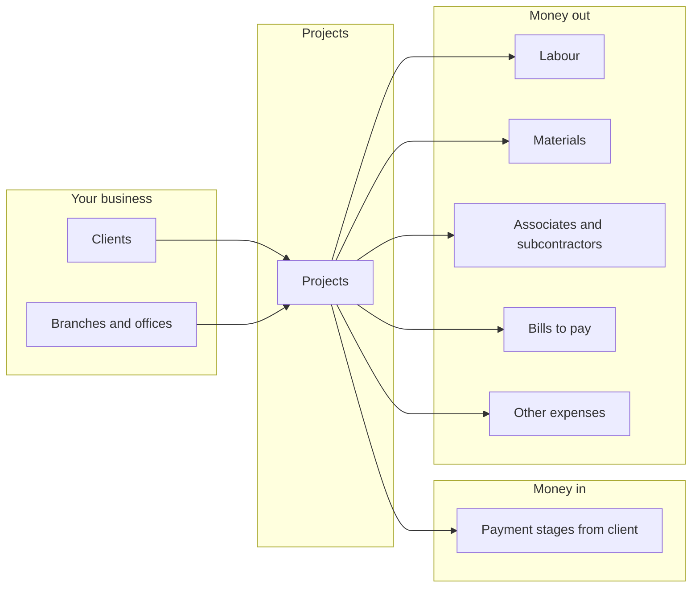
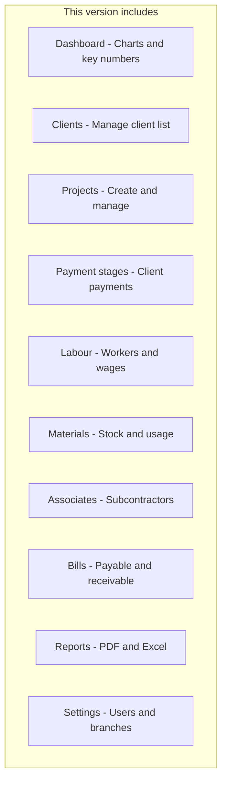
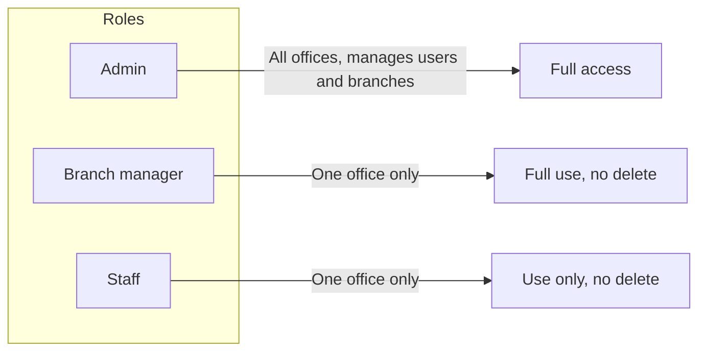
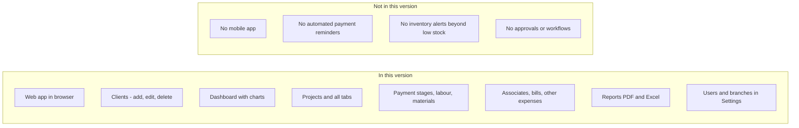

# Buildops — What you have (MVP overview)

Buildops is construction business management software. It helps you track projects, money coming in from clients, and money going out to labour, materials, subcontractors, and bills—across one or more offices (branches). This document describes what is in the current MVP and who can use it.

---

## How Buildops works at a glance

Every project is linked to a client and a branch. You record what the client should pay (payment stages) and what you spend (labour, materials, associates, bills, other expenses). The system shows you what is received, what is outstanding, and what you still owe.

---

## What is in the MVP

| Area | What it does |
|------|----------------|
| **Clients** | Manage the client list (add, edit, delete). Required for creating projects. |
| **Dashboard** | See at a glance: active projects, money received this month, what clients owe, what you owe to vendors/labour/associates. Charts show collections over time, project status, and expense breakdown. Low-stock alert and recent projects. |
| **Projects** | Create projects (client, branch, contract value). Open any project to see tabs: Overview, Payment stages, Labour, Materials, Associates, Bills, Other expenses. |
| **Payment stages** | Break the contract into stages (e.g. Advance, Foundation). Record when the client pays; see Pending / Partially paid / Paid. |
| **Labour** | Add workers, days, rate. Record payments; see what is still due. |
| **Materials** | List material types and stock. From a project: add Purchase (stock goes up) or Usage (stock goes down). System warns when stock is low. |
| **Associates** | Add subcontractors and agreed amount per project. Record payments; see outstanding. |
| **Bills** | Record bills you need to pay or that clients need to pay you. Link to project, record payments. Only bills linked to a project appear in that project's Overview and totals. |
| **Reports** | View and download reports (e.g. profit and loss, collections, pending bills) as PDF or Excel. |
| **Settings** | Admins only: add users and manage branch names. |

---

## Who can use it

| Role | Sees | Can do |
|------|------|--------|
| **Admin** | All branches and all projects | Everything. Add and edit users and branches in Settings. |
| **Branch manager** | Only their branch and its projects | Add and edit data; cannot delete records. |
| **Staff** | Only their branch and its projects | Add and edit data; cannot delete records. |

---

## In this version vs not in this version

**In this version:** Everything described above: clients, dashboard, projects, payment stages, labour, materials, associates, bills, reports, and settings. You use the app in a web browser.

**Not in this version:** There is no separate mobile app, no automatic reminders (e.g. for due payments), and no extra approval workflows. Low-stock warning is the only inventory alert.

---

For step-by-step how to use the system, see **[USER_GUIDE.md](USER_GUIDE.md)**. For a very short “first 5 minutes” path, see **[QUICK_START.md](QUICK_START.md)**.
