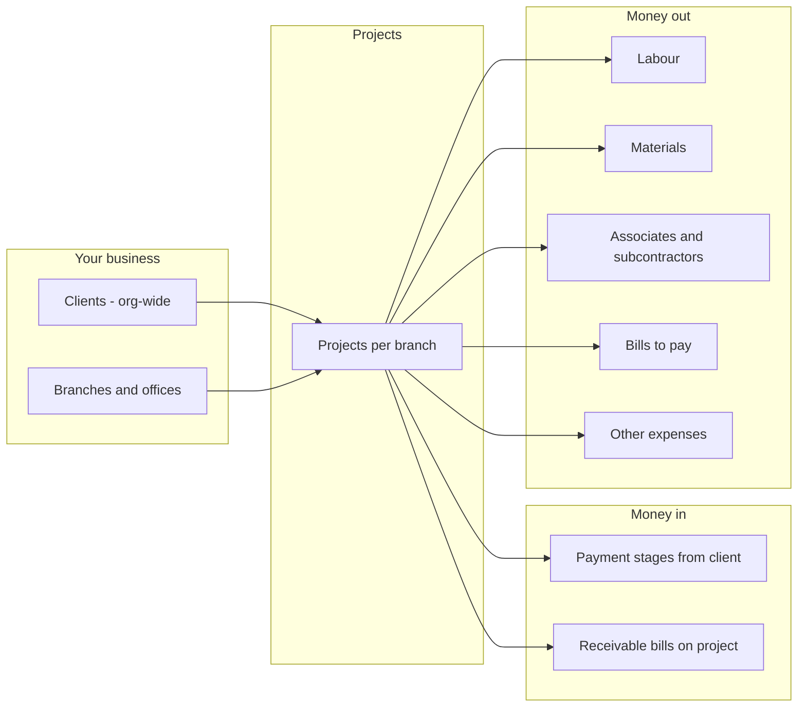
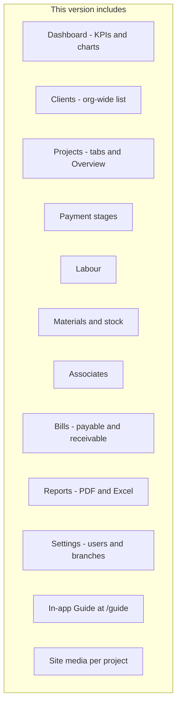
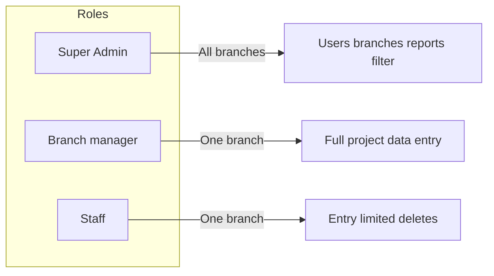
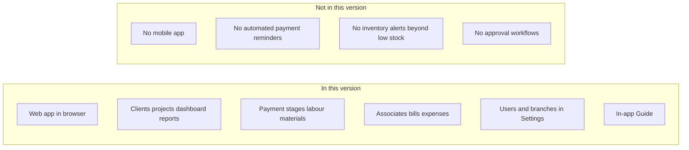

# Buildops — What you have (MVP overview)

Buildops is construction business management software. It helps you track projects, money coming in from clients, and money going out to labour, materials, subcontractors, and bills—across one or more offices (branches). This document describes what is in the current MVP and who can use it.

---

## How Buildops works at a glance

Every project is linked to a **client** (shared across the company) and a **branch**. You record what the client should pay (payment stages and optional receivable bills) and what you spend (labour, materials, associates, payable bills, other expenses). The system shows what is received, what is outstanding, and what you still owe.

For end-to-end flows, see **[WORKFLOW.md](WORKFLOW.md)**.

---

## What is in the MVP

| Area | What it does |
|------|----------------|
| **Clients** | Organization-wide client list (add, edit, delete). Not branch-scoped. Required for projects. |
| **Dashboard** | Active projects, received this month, client outstanding, pending to vendors/labour/associates, charts, **company-wide** low-stock alert, recent projects (cards). Super Admin can filter by branch. |
| **Projects** | Status: Enquiry, Active, On hold, Completed, Cancelled. Tabs: Overview, Payment Stages, Labour, Materials, Associates, Bills, Other Expenses, **Site media**, **Guide**. |
| **Site media** | Per-project photos, PDFs, and videos (date + note). Optional links to payment stages and cost rows. Internal team only. |
| **Payment stages** | Milestones and receipts; contract value drives contract outstanding. |
| **Labour / Materials / Associates / Bills / Other expenses** | Project costs; bills can be payable or receivable. Receivable bill **totals** add to Overview **total income** and profit. |
| **Reports** | Five report types with PDF/Excel export (see USER_GUIDE for names and parameters). |
| **Settings** | Sidebar link for all users; **only Super Admin** manages users and branches. |
| **Help** | `/guide`, `/guide/detailed`, `/guide/workflow` (fictional step-by-step example), and project **Guide** tab. |

---

## Who can use it

| Role | Sees | Can do |
|------|------|--------|
| **Super Admin** | All branches and projects | Everything operational; **Settings** (users, branches); filter Dashboard/Reports by branch; **delete projects** (API). |
| **Branch manager** | Own branch and its projects | Add and edit project data; **delete** payment stages, labour, material items, and other expenses on projects; **delete clients** with no projects; **cannot** delete projects or manage Settings content. |
| **Staff** | Own branch and its projects | Add and edit project data; **cannot delete** payment stages, labour, material items, or other expenses; **can delete clients** with no projects; **cannot** manage Settings content. |

**Settings menu:** Visible to everyone; configuration is **Super Admin only**.

**Bills:** No delete in the MVP—create bills and record payments only.

Detailed permission matrix: **[WORKFLOW.md §9](WORKFLOW.md#9-permissions-quick-reference-delete)**.

---

## In this version vs not in this version

**In this version:** Everything in the table above. You use the app in a web browser.

**Not in this version:** No separate mobile app, no automatic payment reminders, and no multi-step approval workflows. Low-stock warning is the main inventory alert.

**Internal note:** `/dashboard-preview` is an authenticated design gallery for the dashboard UI; it is not part of end-user training docs.

---

## Related documentation

| Document | Use when |
|----------|----------|
| **[WORKFLOW.md](WORKFLOW.md)** | You want flows: money in/out, roles, Overview vs Dashboard vs Reports |
| **[USER_GUIDE.md](USER_GUIDE.md)** | You want step-by-step instructions with diagrams |
| **[QUICK_START.md](QUICK_START.md)** | You want a 5-minute first run |
| **[PROJECT_TABS_AND_CALCULATIONS_SUMMARY.md](PROJECT_TABS_AND_CALCULATIONS_SUMMARY.md)** | You need formulas and calculation rules |
