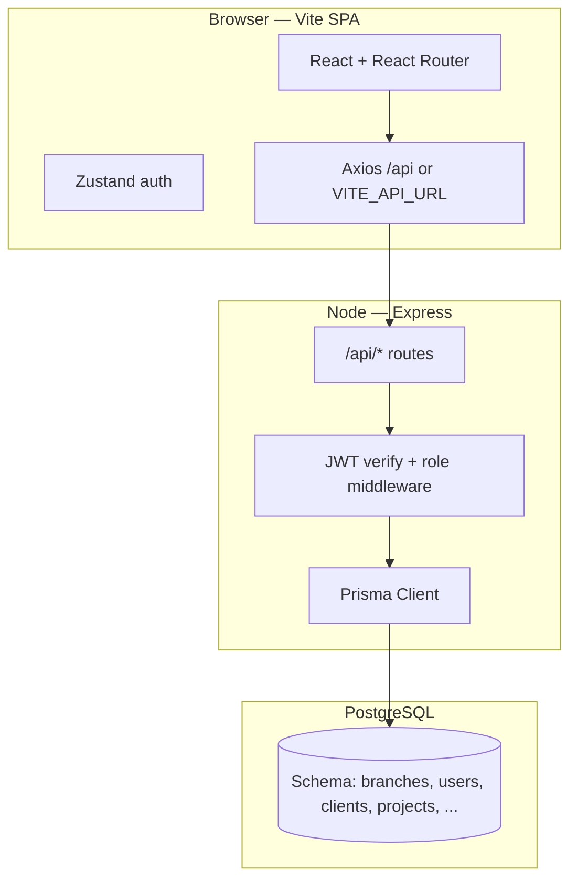

# Buildops

**Construction business management — MVP web app**

Track projects, client payment stages, labour, materials, subcontractors, bills, and other expenses across one or more branches. Role-based access with JWT auth, REST API, and a React SPA.

---

## Hero

Full-stack **Buildops** MVP: plan and record money in and money out per project, with dashboards, PDF/Excel reports, and admin settings for users and branches. Built as a **monorepo** (React + Vite client, Express API, Prisma + PostgreSQL).

| | |
|--|--|
| **Live demo** | `[Your Vercel URL — placeholder]` |
| **API** | `[Your Render URL — placeholder]` |
| **Repository** | `[Your GitHub URL — placeholder]` |

---

## Overview / Problem

Small and mid-sized construction operations often juggle **spreadsheets and ad hoc notes** for contracts, stage-wise client collections, site costs, stock, and payables. That makes it hard to see **per-project profitability**, **what clients still owe**, and **what the business owes** to labour, vendors, and associates—especially when work spans **multiple offices (branches)**.

Buildops addresses that by tying every project to a **client** and a **branch**, then centralizing **payment stages**, **labour**, **material movements**, **associate (subcontractor) payments**, **bills**, and **other expenses** in one place—with a **dashboard** and **exportable reports**.

*(Product scope and wording aligned with `docs/BUILDOPS_OVERVIEW.md` and `CURSOR_SPEC.md`.)*

---

## Tech stack and architecture

### Confirmed versions (from `package.json` files)

| Layer | Technology | Version (lockfile may pin patches) |
|-------|------------|-------------------------------------|
| Runtime | Node.js | LTS assumed for deployment; Express **^4.21.0** |
| API | Express | **^4.21.0** |
| Auth | `jsonwebtoken`, `bcrypt` | **^9.0.2**, **^5.1.1** |
| ORM / DB | Prisma, PostgreSQL | `@prisma/client` **^5.22.0**; DB **15+** per spec/README |
| Exports | `pdfkit`, `exceljs` | **^0.15.0**, **^4.4.0** |
| Client | React, Vite | **^18.3.1**, **^5.4.10** |
| Routing | React Router | **^6.28.0** |
| State | Zustand | **^5.0.1** |
| Styling | Tailwind CSS | **^3.4.14** |
| Charts / motion | Recharts, Framer Motion | **^3.8.0**, **^12.35.2** |
| HTTP | Axios | **^1.7.7** |

**Note:** `CURSOR_SPEC.md` lists **shadcn/ui** as part of the target stack; this repo implements **Tailwind** with **local UI primitives** under `client/src/components/ui` (e.g. `button.jsx`, `input.jsx`, `card.jsx`)—not a published `@radix-ui/*` dependency in `package.json`.

### High-level architecture

- **API surface:** All JSON routes live under `/api` (see `server/src/app.js`). **Health:** `GET /api/health` returns `{"success":true,"message":"Buildops API"}`.
- **Auth:** `POST /api/auth/login`, `GET /api/auth/me` (Bearer token). Protected routes use `verifyToken` and often `requireRole([...])`.
- **Branch scoping (projects & dashboard):** Non–super-admins are limited by `req.user.branchId` (e.g. project list/detail/update and dashboard aggregates use branch-filtered project IDs). **Super admin** can filter by `branchId` query where implemented (e.g. dashboard/reports). **Clients** are **not** branch-scoped in the Prisma schema—they are shared across the org; **projects** carry `branchId`.
- **RBAC (user-facing summary):** See **`docs/WORKFLOW.md`** and **`docs/BUILDOPS_OVERVIEW.md`**. Example: **project delete** is **SUPER_ADMIN** only; **STAFF** cannot delete payment stages, labour, material items, or other expenses on a project; **BRANCH_MANAGER** can delete those; **client delete** is allowed for all roles when the client has no projects.

---

## Features

Cross-checked against **`docs/BUILDOPS_OVERVIEW.md`** and **`CURSOR_SPEC.md`** and implemented routes in **`server/src/app.js`** + **`client/src/routes.jsx`**.

| Area | What the MVP includes |
|------|-------------------------|
| **Auth** | Login, session user (`/me`), JWT on requests, 401 → logout redirect (`client/src/api/axios.js`). |
| **Dashboard** | Aggregates tied to branch-scoped projects (and admin branch filter where supported). Charts (Recharts). |
| **Clients** | List/search, create, update, delete (delete blocked by API if client has projects). |
| **Projects** | List/create/edit/detail; nested data: payment stages, labour, material items, associates, expenses; summary endpoint. |
| **Payment stages & receipts** | Stage-wise client billing; receipts with modes (cash, bank, cheque, UPI, etc.). |
| **Labour** | Worker lines, rates/days, paid vs total. |
| **Materials** | Material catalog + **purchase / usage** lines on projects; stock and low-threshold concepts per schema. |
| **Associates** | Subcontractor payments and transactions. |
| **Bills** | Payable/receivable; optional `projectId` (bills without project still affect dashboard payables query). No DELETE endpoint. |
| **Other expenses** | Per-project miscellaneous costs. |
| **Reports** | PDF (`pdfkit`) and Excel (`exceljs`) generation (`report.controller.js`). **Project P&L** uses contract-based profit; project **Overview** includes receivable bills in `totalIncome`—see `docs/WORKFLOW.md`. |
| **Settings** | Users and branches (branches API **SUPER_ADMIN** only). |
| **Guide** | In-app **User Guide** at `/guide` and `/guide/detailed` (per README). |

**Frontend routes (lazy-loaded):** Login, Guide, Guide detailed, Dashboard, Dashboard preview (`/dashboard-preview`, auth), Projects (list/new/edit/detail), Clients, Materials, Bills, Reports, Settings (`React.lazy` + `Suspense` in `client/src/routes.jsx`).

**Documentation (repo):** `docs/BUILDOPS_OVERVIEW.md`, `docs/USER_GUIDE.md`, `docs/WORKFLOW.md`, `docs/QUICK_START.md`, `docs/PROJECT_TABS_AND_CALCULATIONS_SUMMARY.md`.

**Explicitly out of scope** (per `BUILDOPS_OVERVIEW.md`): native mobile app, automated payment reminders, approval workflows, inventory alerts beyond low-stock.

---

## Challenges and solutions

| Challenge | How this repo addresses it |
|-----------|------------------------------|
| **Multi-branch access** | Roles `SUPER_ADMIN`, `BRANCH_MANAGER`, `STAFF`; branch id on user; project queries and dashboard scope branch for non-admins. |
| **Readable money picture** | Dashboard + project Overview + reports; payment stage receipts vs contract value; see WORKFLOW for P&L vs Overview. |
| **Exports for stakeholders** | Server-side PDF and Excel using `pdfkit` and `exceljs`. |
| **Split hosting** | Frontend and API on different origins → **CORS** limited to `CLIENT_URL` (`server/src/app.js`); production API base URL via **`VITE_API_URL`** (`client/src/api/axios.js`). |
| **Render build + Supabase limits** | `DEPLOY.md` documents avoiding `prisma migrate deploy` / `db push` on Render build when pooler limits bite; generate client only on deploy, apply schema from local/CI against the same DB. |

---

## Performance, security, and testing

### Performance

- **Code splitting:** Route-level **lazy loading** reduces initial bundle size (`client/src/routes.jsx`).
- **Dev proxy:** Vite proxies `/api` to `http://localhost:5000` (`client/vite.config.js`).
- **Production:** `DEPLOY.md` notes Render **free-tier cold starts** (30–60s) as a practical latency factor; optional uptime ping mentioned there.

### Security (implemented patterns)

- **Passwords:** `bcrypt` on login (`auth.controller.js`).
- **API auth:** Bearer JWT; middleware rejects missing/invalid tokens (`auth.middleware.js`).
- **Roles:** `requireRole` loads user from DB, checks active flag and role (`role.middleware.js`).
- **CORS:** `origin: process.env.CLIENT_URL`, `credentials: true`.
- **Input handling:** Controllers validate required fields and enums (e.g. project status) in representative paths.

**Hardening note (accurate to code):** `server/src/utils/jwt.js` falls back to a **default secret** if `JWT_SECRET` is unset—production must always set a strong `JWT_SECRET` (as `DEPLOY.md` and `.env` examples require).

### Testing

**Honest status:** Root, `server`, and `client` **`package.json` files define no `test` script** and there are **no `*.test.*` / `*.spec.*` files** in the repo tree. **No Jest, Vitest, Cypress, or Playwright** dependencies were found in those manifests.

**Implication for a portfolio:** Describe this as an MVP focused on **feature delivery and manual verification**; automated tests are a **known gap** and next step—not a current claim.

---

## Deployment

Aligned with **`DEPLOY.md`** (Supabase + Render + Vercel + GitHub).

| Step | Platform | Purpose |
|------|----------|---------|
| 1 | **Supabase** | Managed PostgreSQL; `DATABASE_URL` (pooler URI, password embedded). |
| 2 | **Local (or CI)** | `prisma migrate deploy` or `db push`; `npm run prisma:seed` in `server` against that DB. |
| 3 | **Render** | Web service: **Build** `cd server && npm install && npx prisma generate --schema=../prisma/schema.prisma`; **Start** `cd server && node src/server.js`. |
| 4 | **Client env** | Set `VITE_API_URL` to Render **origin** without `/api` suffix; axios appends `/api` in code. |
| 5 | **Vercel** | Root directory **`client`**; build `npm run build`; output `dist`; SPA fallback via `client/vercel.json`. |
| 6 | **Render env** | Set `CLIENT_URL` to the **Vercel** URL (no trailing slash) so CORS matches. |

**Render environment variables** (from `DEPLOY.md`): `DATABASE_URL`, `JWT_SECRET` (≥32 chars recommended), `CLIENT_URL`, `NODE_ENV=production`.

**Vercel:** `VITE_API_URL` = Render service URL (no `/api`).

**Health check after deploy:** `GET https://<render-service>/api/health` → JSON success payload as above.

---

## Learnings

- **Domain modeling:** A single **Project** hub with tabs matches how site teams think (stages, labour, materials, subs, bills)—and maps cleanly to REST sub-resources under `/api/projects/...`.
- **Branch scoping:** Putting **branch** on **Project** (not on **Client**) is a deliberate trade-off: shared client list, branch-specific execution—worth explaining to stakeholders.
- **Ops reality:** **Split deploys** (static front + sleeping API) teach **env naming**, **CORS**, and **cold start** behavior as first-class concerns.
- **Specification vs tree:** Keeping **`CURSOR_SPEC.md`**, **`docs/BUILDOPS_OVERVIEW.md`**, and **`docs/WORKFLOW.md`** in sync with routes and RBAC reduces doc drift.

---

## Links and CTA

- **Repository:** `[GitHub — placeholder]`
- **Live app:** `[Vercel — placeholder]`
- **API health:** `[Render base URL]/api/health`
- **Contact / portfolio:** `[Your site or LinkedIn — placeholder]`

---

*Accuracy: Written to match this repository’s docs and selected source files (see maintainer note below). No mobile app, workflow engine, or automated test suite is claimed.*

### Maintainer note — sources checked

`CURSOR_SPEC.md`, `README.md`, `DEPLOY.md`, `docs/BUILDOPS_OVERVIEW.md`; `server/package.json`, `client/package.json`, root `package.json`; `server/src/app.js`; `server/src/middleware/auth.middleware.js`, `role.middleware.js`; `server/src/controllers/project.controller.js`, `auth.controller.js`, `report.controller.js` (exports + branch helper); `server/src/routes/project.routes.js`, `auth.routes.js`, `client.routes.js`, `user.routes.js`, `branch.routes.js`; `client/src/routes.jsx`, `client/src/api/axios.js`, `client/vite.config.js`; `prisma/schema.prisma`. Repo tree scanned for test files and test runners — none present in `package.json` manifests checked.
