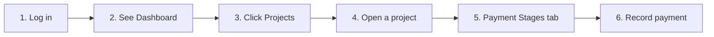

# CBMS — Get going in 5 minutes

Use this page when you have just received access and want to do one thing: log in, open a project, and record a client payment. The diagram below is the path; under it are short notes for each step.

**1. Log in** — Open the CBMS app in your browser. Enter your email and password. If you have a demo account, use for example **admin@company.com** with password **admin123**.

**2. See Dashboard** — After login you land on Home. You will see stat cards, charts, and a list of recent projects. This is your overview; you do not need to change anything here for the first task.

**3. Click Projects** — In the left menu, click **Projects**. You will see the list of projects. If the client you need is not in the list when creating a project, open **Clients** from the menu and add them first. Then click **New Project** if you need to create one (client, branch, contract value); otherwise pick an existing project.

**4. Open a project** — Click the project name. The project opens with tabs: Overview, Payment stages, Labour, Materials, and others.

**5. Payment Stages tab** — Click the **Payment stages** tab. If there is no stage yet, add one (e.g. “Advance”, amount, due date). Then use **Record payment** on that stage.

**6. Record payment** — Enter the amount the client paid, the date, and how they paid (e.g. bank transfer). Save. The stage will show as Partially paid or Paid depending on the amount.

For more detail on the Dashboard, projects, materials, reports, and settings, see **[USER_GUIDE.md](USER_GUIDE.md)**. You can also open the **Guide** from the app (link in the sidebar after you sign in).
