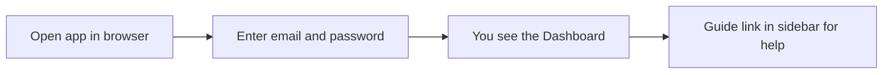
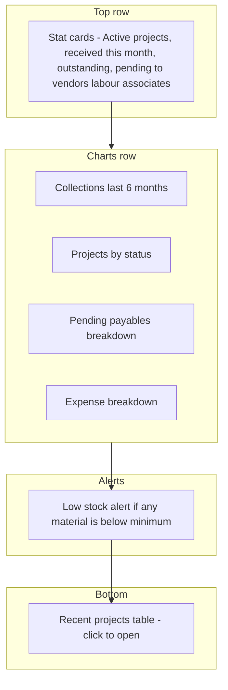
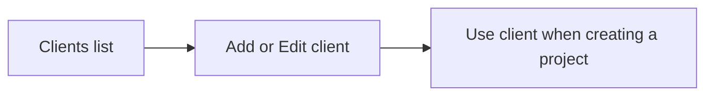
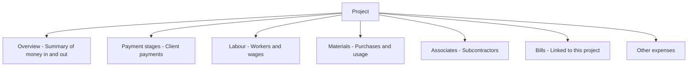
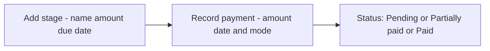
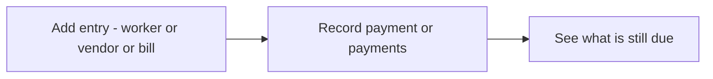
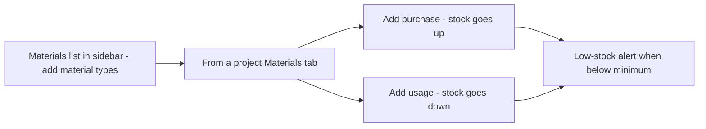
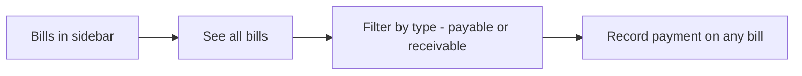
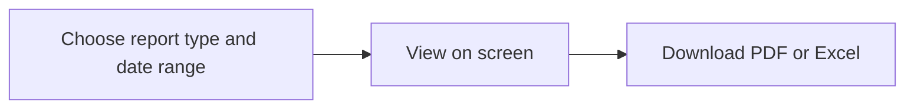

# CBMS — How to use the system

This guide explains how to use CBMS step by step. Each section starts with a diagram, then a short explanation. You can also use the **Guide** inside the app (linked from the login page and the sidebar after you sign in).

---

## Logging in

Open the CBMS app in your browser and enter your email and password. After you sign in, you land on the Home (Dashboard). Use the **Guide** link in the left menu anytime to open the in-app help. If your company has set up sample accounts, you can use the logins in the table below (password **admin123** for all).

| Who | Email | Password | Sees |
|-----|-------|----------|------|
| Admin | admin@company.com | admin123 | All offices |
| Branch manager | manager-a@company.com | admin123 | Branch A only |
| Branch manager | manager-b@company.com | admin123 | Branch B only |
| Staff | staff-a1@company.com | admin123 | Branch A only |
| Staff | staff-b1@company.com | admin123 | Branch B only |

---

## Home (Dashboard)

The Dashboard shows your key numbers at a glance. The **stat cards** tell you how many projects are active, how much was received this month, what clients still owe, and what you owe to vendors, labour, and associates. The **charts** show collections over the last six months, how projects are distributed by status (Active, Completed, etc.), pending payables by type, and how expenses are split. If any material is below its minimum stock, a **low-stock alert** appears with a link to manage materials. At the bottom, **Recent projects** lists the latest projects—click one to open it. If you are an admin, you can filter the whole dashboard by **Branch** at the top.

---

## Clients

Open **Clients** from the left menu to manage the organizations you work for. Add, edit, or remove clients here (name, phone, email, address). Each project must be assigned a client from this list.

---

## Projects

From the left menu, click **Projects**, then **New Project** to create one (you need client, branch, contract value, and optional dates). If the client is not in the list, go to **Clients** and add them first. Click any project name to open it. Inside a project you see **tabs**: Overview (summary of contract value, received, outstanding, expenses, profit), Payment stages, Labour, Materials, Associates, Bills, and Other expenses. Use each tab to add and track that type of information. Everything you enter here feeds the project summary and the reports.

---

## Payment stages (money in)

Payment stages are how you track money coming in from the client. In the project, open the **Payment stages** tab. Add a stage (e.g. “Advance”, amount, due date). When the client pays, click **Record payment** on that stage and enter the amount received, date, and how they paid (cash, bank transfer, cheque, UPI). The stage status becomes Pending (nothing received), Partially paid (some received), or Paid (full amount received). The Overview tab and Dashboard use this to show outstanding from clients and collections. Contract value is the single source of truth for revenue and outstanding; stage expected amounts are for tracking milestones and do not need to sum to the contract value.

---

## Labour, materials, associates, bills, other expenses (money out)

All project costs work the same way: you add an entry (e.g. a worker with days and rate, a subcontractor with agreed amount, a bill to pay), then record payments as you pay. The system shows how much is still outstanding. In the project: **Labour** tab—add workers, days, rate; record payments. Labour payments are recorded as a single paid amount and date per entry; for multiple or partial payments you can update the same entry with the cumulative paid amount and latest date (and optionally add a note). **Materials** tab—add purchases (stock goes up) or usage (stock goes down) for materials used on this project. **Associates** tab—add subcontractors and agreed amount; record payments. **Bills** tab—add bills linked to this project (payable or receivable); record payments. **Other expenses** tab—add any other cost (e.g. permit, transport) with description and amount. Each tab feeds the project Overview and the Reports.

---

## Materials (global list and stock)

Click **Materials** in the left menu to see all material types and their current stock. Add new material types here (name, unit, minimum threshold). Purchases and usage are recorded **from inside each project** (Materials tab → Add purchase or Add usage). A purchase increases stock; a usage decreases it. When stock for any material falls below its minimum, the Dashboard shows a low-stock alert and a link to the Materials page.

---

## Bills (global list)

Click **Bills** in the left menu to see all bills—both ones you need to pay (vendors) and ones clients need to pay you. You can filter by type. Open a bill to record a payment (amount, date, mode). Bills can be linked to a project or standalone. Only bills linked to a project appear in that project's Overview and totals; unlinked bills are company-level and do not affect any project Overview. The Dashboard “Pending to vendors” and Reports use this data.

---

## Reports

Click **Reports** in the left menu. Pick the report you need (e.g. profit and loss, collections, pending bills, labour or material costs) and the date range. If you are an admin, you can also choose which branch to report on. View the result on screen, then use the buttons to **download PDF or Excel**. Reports use the same data you enter in projects, payment stages, labour, materials, associates, and bills.

| Report | What it shows |
|--------|----------------|
| Profit and loss | Project-wise income and costs and profit |
| Collections | Money received in a period |
| Pending bills | Bills not yet fully paid |
| Labour / material costs | Totals by type in a period |

---

## Settings

Only **admins** can open Settings. Click **Settings** in the left menu to add or edit **users** (email, role, branch) and to manage **branches** (office names). Staff and branch managers do not see Settings. For sample logins and roles, see the table in the [Logging in](#logging-in) section or [CBMS_OVERVIEW.md](CBMS_OVERVIEW.md).

---

For a short “first 5 minutes” path, see **[QUICK_START.md](QUICK_START.md)**. For what is in the MVP and who can use it, see **[CBMS_OVERVIEW.md](CBMS_OVERVIEW.md)**.
