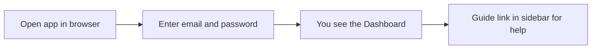
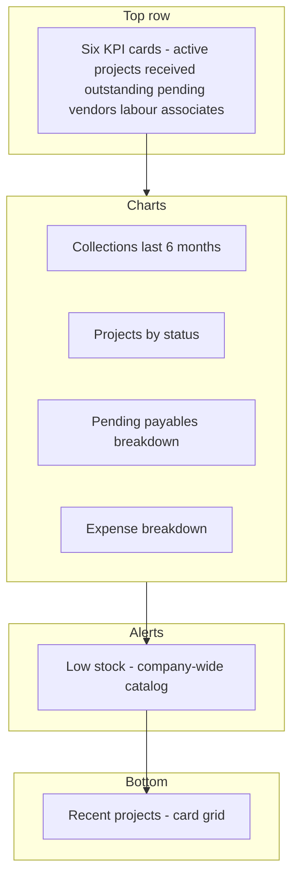
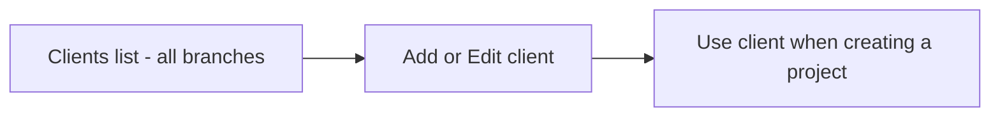
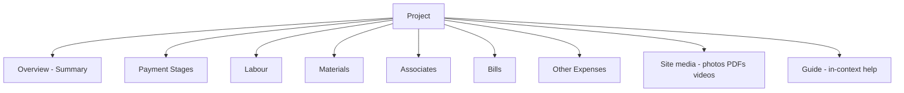
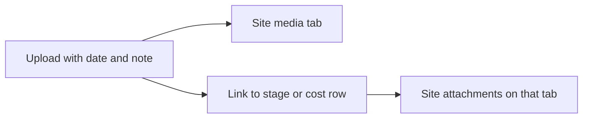
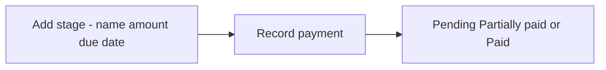
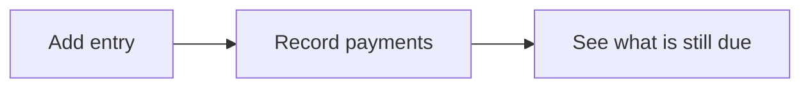
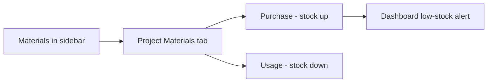
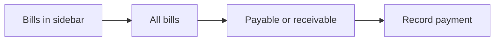
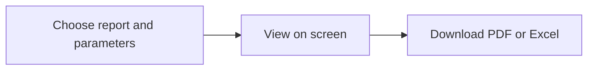

# Buildops — How to use the system

This guide explains how to use Buildops step by step. Each section starts with a diagram, then a short explanation. You can also use the **Guide** inside the app (linked from the login page and the sidebar after you sign in), including **Guide → Detailed** at `/guide/detailed` and **Detailed workflow** at `/guide/workflow` (a step-by-step example with made-up project names and amounts—not your live data).

For role-based flows and how data reaches Dashboard and Reports, see **[WORKFLOW.md](WORKFLOW.md)**.

---

## Logging in

Open the Buildops app in your browser and enter your email and password. After you sign in, you land on the **Dashboard**. Use the **Guide** link in the left menu anytime to open the in-app help.

All seeded accounts use password **admin123** (after running the database seed).

| Who | Email | Password | Sees |
|-----|-------|----------|------|
| Super Admin | admin@company.com | admin123 | All offices |
| Branch manager | manager-a@company.com | admin123 | Branch A only |
| Branch manager | manager-b@company.com | admin123 | Branch B only |
| Staff | staff-a1@company.com | admin123 | Branch A only |
| Staff | staff-a2@company.com | admin123 | Branch A only |
| Staff | staff-b1@company.com | admin123 | Branch B only |
| Staff | staff-b2@company.com | admin123 | Branch B only |

---

## Home (Dashboard)

The Dashboard shows your key numbers at a glance.

- **KPI cards:** Active projects, received this month, outstanding from clients, and pending amounts to vendors, labour, and associates.
- **Charts:** Collections over six months, project status mix, payables breakdown, and an expense breakdown (this chart mixes **paid** and **committed** amounts—see [WORKFLOW.md](WORKFLOW.md#7-where-numbers-appear-overview-vs-dashboard-vs-reports)).
- **Low stock:** Uses the **global** materials catalog (not limited by the branch filter).
- **Recent projects:** Card grid; click a project to open it.

If you are a **Super Admin**, use the **branch** filter at the top to scope dashboard aggregates.

---

## Clients

Open **Clients** from the left menu. The list is **shared across the organization** (not per branch). Add, edit, or remove clients here (name, phone, email, address). You cannot delete a client that still has projects. Each project must be assigned a client from this list.

---

## Projects

From the left menu, click **Projects**, then **New Project** to create one (client, branch, contract value, status, optional dates). Non–Super Admins are tied to their branch on new projects. Click any project name to open it.

**Tabs:** Overview, Payment Stages, Labour, Materials, Associates, Bills, Other Expenses, **Site media**, and **Guide**. Everything you enter feeds the project **Overview** and most reports (site media does not change Overview numbers).

Project statuses include **Enquiry**, **Active**, **On hold**, **Completed**, and **Cancelled**.

---

## Site media (photos, PDFs, videos)

Open a project → **Site media**. Upload **images**, **PDFs**, or **short videos**. Each upload needs a **date** and a **short note**.

- Use the gallery for general progress photos.
- Optionally **link** a file to a payment stage, labour line, material entry, associate, bill, or other expense—or add from **Site attachments** on those tabs.
- **Everyone** on the team can upload. **Branch managers** and **Super Admins** can delete. **Staff** cannot delete.
- If you delete a payment stage or cost line, linked files stay in **Site media** (they are unlinked, not removed).
- The **Overview** tab does not show thumbnails; use **Site media** or the attachments section on each tab.

---

## Payment stages (money in)

Payment stages track money coming in against the **main contract**. Add a stage, then **Record payment** when the client pays (amount, date, mode: cash, bank transfer, cheque, UPI).

- **Total received** = sum of all stage receipts.
- **Contract outstanding** = contract value − total received (on Overview this can go negative if you record more than the contract).
- Stage **expected amounts** are for milestones; they **do not have to sum** to the contract value.

**Additional income:** Receivable **bills** on the project (Bills tab) add to **Other receivables** and **Total income** on Overview and affect profit. See [WORKFLOW.md](WORKFLOW.md#3-money-in-client--you).

---

## Labour, materials, associates, bills, other expenses (money out)

- **Labour** — workers, days, rate; update paid amount and date (one row per worker entry).
- **Materials** — purchase (stock up) or usage (stock down) on this project.
- **Associates** — agreed amount and payment transactions.
- **Bills** — payable (you owe) or receivable (client owes extra); record payments. Only bills **linked to this project** affect its Overview.
- **Other expenses** — miscellaneous costs.

Payable bill and expense **totals** on Overview use **full invoice/commitment amounts**, not only cash paid so far.

**Deleting entries:** Staff cannot delete payment stages, labour lines, material items, or other expenses; branch managers and Super Admins can. There is no delete for bills—only payments.

---

## Materials (global list and stock)

Use **Materials** in the sidebar to define material types (unit, minimum threshold). Record purchase and usage **on each project**. When any material falls below its minimum, the Dashboard shows a low-stock alert linking to **Materials**.

---

## Bills (global list)

**Bills** lists company bills. Bills may be linked to a project or standalone. Unlinked bills do not change any project Overview but can affect **Dashboard** payables. Record payments from the list or from a project’s Bills tab.

---

## Reports

Open **Reports**. Super Admin can pick a **branch**. Parameters depend on the report (see table).

| Report (UI name) | What it shows | Parameters |
|------------------|---------------|------------|
| **Project Dashboard (P&L)** | Per-project contract value, costs, profit | Optional date range (filters projects by start/end dates), branch |
| **Payment Collection** | Receipts in a calendar month | **Month and year**, branch |
| **Pending Vendor Bills** | Bills not fully paid | Branch (includes pending **receivable** bills as well as payables) |
| **Labour Cost Analysis** | Labour totals by project | Branch |
| **Material Usage Log** | **USAGE quantities** by material name | Branch |

**Important:** **Project Dashboard (P&L)** profit uses **contract value minus expenses** and does **not** include receivable bills in income. For profit with receivables, use the project **Overview** tab. See [WORKFLOW.md](WORKFLOW.md#7-where-numbers-appear-overview-vs-dashboard-vs-reports).

---

## Settings

The **Settings** link appears in the sidebar for **all roles**. Only **Super Admins** can manage **users** and **branches**. Branch managers and staff who open Settings see an access-restricted message.

Sample logins are in the [Logging in](#logging-in) section above. Role summary: **[BUILDOPS_OVERVIEW.md](BUILDOPS_OVERVIEW.md)** and **[WORKFLOW.md](WORKFLOW.md)**.

---

## More documentation

| Document | Purpose |
|----------|---------|
| **[QUICK_START.md](QUICK_START.md)** | First 5 minutes after install |
| **[WORKFLOW.md](WORKFLOW.md)** | End-to-end workflows and permissions |
| **[BUILDOPS_OVERVIEW.md](BUILDOPS_OVERVIEW.md)** | MVP scope and roles |
| **[PROJECT_TABS_AND_CALCULATIONS_SUMMARY.md](PROJECT_TABS_AND_CALCULATIONS_SUMMARY.md)** | Calculation reference |
