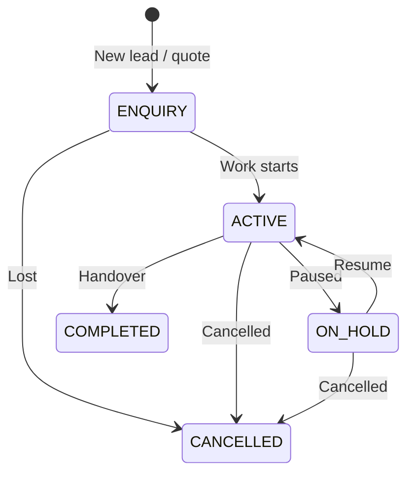
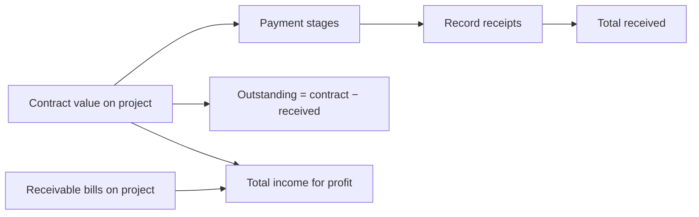
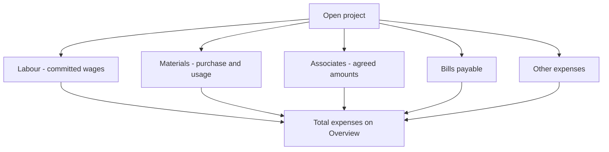
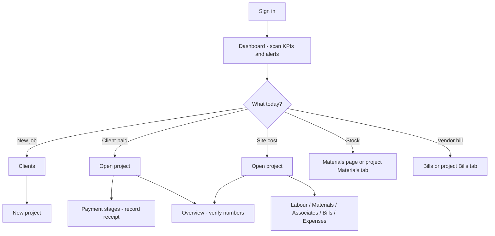

# Buildops — End-to-end workflows

This document describes **how work flows through Buildops**: from setup to daily data entry, how money moves, and how that data appears on the **project Overview**, **Dashboard**, and **Reports**. For click-by-click steps, see **[USER_GUIDE.md](USER_GUIDE.md)**. For formulas, see **[PROJECT_TABS_AND_CALCULATIONS_SUMMARY.md](PROJECT_TABS_AND_CALCULATIONS_SUMMARY.md)**.

---

## 1. Who does what (roles)

| Role (app label) | Code | Scope | Typical workflow |
|------------------|------|--------|------------------|
| **Super Admin** | `SUPER_ADMIN` | All branches | Create branches and users in **Settings**, create clients and projects anywhere, filter **Dashboard** and **Reports** by branch, delete **projects** (API only; rare in UI). |
| **Branch Manager** | `BRANCH_MANAGER` | Own branch | Run projects for one office: enter stages, costs, bills; can **delete** most project-tab records and **clients** (if no projects). Cannot manage users/branches. |
| **Staff** | `STAFF` | Own branch | Same day-to-day entry as manager; **cannot delete** payment stages, labour lines, material items, or other expenses on a project. Can still **delete clients** when they have no projects. |

**Settings:** The **Settings** link appears in the sidebar for everyone. Only **Super Admins** can manage users and branches; others see an access-restricted message.

**Clients** are **organization-wide** (not tied to a branch). **Projects** are tied to a **branch** and a **client**.

---

## 2. Project lifecycle

Statuses in the app: **Enquiry**, **Active**, **On hold**, **Completed**, **Cancelled**. The Dashboard **Pipeline** chart counts projects by status.

**Standard path:**

1. **Clients** — ensure the client exists (shared list).
2. **Projects → New** — pick client, branch (Super Admin chooses branch; others use their office), contract value, dates, status.
3. Open the project — use tabs to record money in and out (below).
4. **Overview** tab — check received, outstanding, expenses, profit.
5. **Reports** — export P&L or collections for stakeholders (see §6 for P&L vs Overview).

Each project also has a **Guide** tab with in-context help for that screen.

---

## 3. Money in (client → you)

| Step | Where | What happens |
|------|--------|----------------|
| Define contract | Project form | **Contract value** is the main contract amount. |
| Plan milestones | **Payment Stages** tab | Add stages (name, expected amount, due date). Stage amounts **do not have to sum** to the contract. |
| Client pays | **Record payment** on a stage | Receipts update stage status: Pending / Partially paid / Paid. |
| Extra invoices | **Bills** tab (type **Receivable**) | Full **bill total** adds to **Other receivables** and **Total income** on Overview (not reduced by partial payments on the bill). |

**Dashboard — “Received this month”** uses **payment stage receipts** in the current month. **Outstanding (clients)** uses per project `max(0, contract value − total received)` (same idea as Overview contract outstanding, floored on the dashboard aggregate).

---

## 4. Money out (you → labour, materials, subs, vendors)

| Cost type | Tab | Overview bucket | Notes |
|-----------|-----|-----------------|--------|
| Wages | Labour | Labour costs | `totalAmount` vs `paidAmount`; one paid row per entry (update for partial pay). |
| Stock | Materials | Material cost | **Purchase** increases global stock; **Usage** decreases stock and allocates cost to the project. |
| Subcontractors | Associates | Associate fees | `agreedAmount`; payments via transactions. |
| Vendor invoices | Bills (**Payable**) | Bills payable | Full **bill total** in expenses (committed invoice, not cash-only). |
| Misc | Other expenses | Other expenses | Permits, transport, etc. |

Record **payments** as you pay (labour, associates, bills). Outstanding on each line is what you still owe on that entry.

**Materials (global):** Define material types under **Materials** in the sidebar. Movements happen on the project **Materials** tab. **Low-stock** on the Dashboard uses the **company-wide** catalog (not filtered by branch).

**Bills without a project:** Shown on **Bills** list; affect **Dashboard** payables; **do not** affect any project Overview.

---

## 5. Daily operator workflow (branch staff or manager)

1. Sign in → **Dashboard** (collections, pipeline, payables, low stock, recent projects).
2. Open the relevant **project** (or create one).
3. Enter or update the tab that matches the event (receipt, labour day, purchase, usage, bill, expense).
4. Check **Overview** for profit and outstanding.
5. Use **Reports** when you need PDF/Excel for a period or branch.

---

## 6. Admin workflow (Super Admin)

1. **Settings → Branches** — offices (only Super Admin).
2. **Settings → Users** — assign role and branch.
3. **Clients** — maintain shared client list.
4. **Dashboard / Reports** — optional **branch** filter.
5. Align **contract values** and **payment stages** with real contracts (stages are for tracking; contract value drives contract outstanding).

---

## 7. Where numbers appear (Overview vs Dashboard vs Reports)

| Metric | Project Overview | Dashboard | Reports |
|--------|------------------|-----------|---------|
| Contract outstanding | `contract − received` (can go negative if over-paid) | Client outstanding (floored per project) | — |
| Profit | `totalIncome − expenses`; income = contract + **receivable bill totals** | Expense chart (see below) | **Project Dashboard (P&L)** uses **contract − expenses only** (no receivables in income) |
| Collections | From stage receipts | Last 6 months + this month | **Payment Collection** (pick **month + year**) |
| Pending payables | Per project on tabs | Vendor / labour / associate cards | **Pending Vendor Bills** (includes pending **receivable** bills too) |
| Material usage | PURCHASE + USAGE cost | Expense breakdown includes material **committed** cost | **Material Usage Log** = **USAGE quantities**, not rupee P&L |

**Dashboard expense chart:** Mixes **paid** amounts (labour, associates, bill payments) with **committed** material line costs and full **other expense** amounts. It is **not** identical to project Overview expense buckets.

**Canonical profit on a project:** Use **Overview** (`GET /api/projects/:id/summary`). Do not assume **Reports → Project Dashboard (P&L)** matches Overview profit until the report is aligned in code.

---

## 8. Help and related docs

| Resource | Location |
|----------|----------|
| In-app guide (short) | `/guide` (login page + sidebar) |
| In-app guide (detailed) | `/guide/detailed` |
| **Detailed workflow (example)** | `/guide/workflow` — five phases with a fictional sample project (for training; not tied to your live data) |
| Project tab help | **Guide** tab on project detail |
| First 5 minutes | **[QUICK_START.md](QUICK_START.md)** |
| Step-by-step UI | **[USER_GUIDE.md](USER_GUIDE.md)** |
| MVP scope & roles | **[BUILDOPS_OVERVIEW.md](BUILDOPS_OVERVIEW.md)** |
| Formulas & engineering notes | **[PROJECT_TABS_AND_CALCULATIONS_SUMMARY.md](PROJECT_TABS_AND_CALCULATIONS_SUMMARY.md)** |

---

## 9. Permissions quick reference (delete)

| Action | Super Admin | Branch Manager | Staff |
|--------|-------------|----------------|-------|
| Delete **project** | Yes (API) | No | No |
| Delete **client** (no projects) | Yes | Yes | Yes |
| Delete **payment stage / labour / material item / other expense** on project | Yes | Yes | **No** |
| Delete **site media** on project | Yes | Yes | **No** |
| Delete **bills** | — | — | — (no delete API; record payments only) |
| Manage users / branches | Yes | No | No |

For exact API behavior, see server route controllers and `role.middleware.js`.
